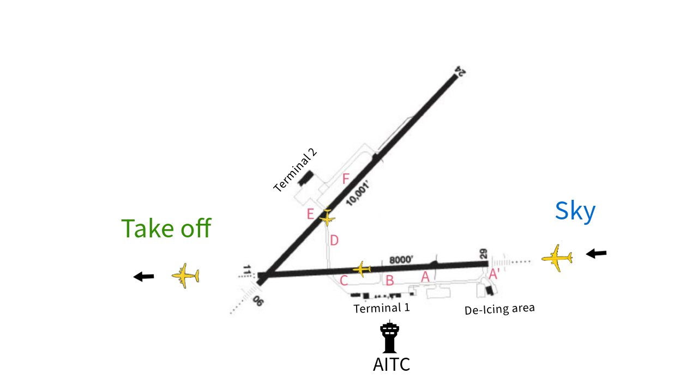

# AITC (Artifical Intelligence Traffic Control)

This project was completed in 24 hours for [MTA Hacks](https://mtahacks.ca/) 2025. The theme for the hackathon was "Novel applications of AI".

In light of a recent increase in aircraft accidents and air traffic controller layoffs, we made this proof of concept for an AI air traffic controller. To achieve this MVP within the time frame, the decision making is hard-coded instead of being done by a trained model. The effectiveness of this simple approach is encouraging for applying AI to the full, more complex optimization problem.

We created a model of the Greater Moncton Roméo LeBlanc International Airport in which we simulate the arrivals and departures of aircrafts. Before any plane moves between locations, they transmit their intentions to AITC. AITC then evaluates if the plane can currently progress to their desired location, if it must wait for a moment while another aircraft moves out of the way, or if their path must be diverted for something like de-icing.

## Authors:
	
[Oscar Schuckel-Bailey](https://github.com/Oscarsb2004)

[Sawyer Stanley](https://github.com/SawyersCoding)

[Dang Khoa Tran](https://github.com/liamtran1611)

[Shunning Xiao](https://github.com/flyingrichard)
